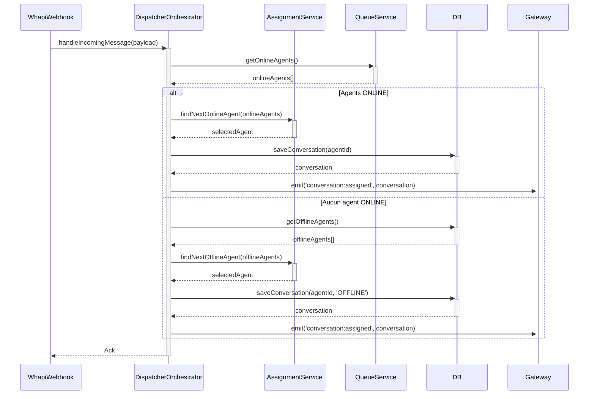

# Cahier des Charges Technique - Module Dispatcher

## 🎯 Principe Fondamental : Séparation des Responsabilités (SoC)

Le module dispatcher est le cœur du système et doit être maintenable, testable et évolutif. Pour cela, une séparation stricte des responsabilités est obligatoire.

1.  **Orchestrateur (Side effects)** : Le `DispatcherOrchestrator` est le seul service exposé aux autres modules. Il gère le workflow, interagit avec la base de données, et déclenche les événements WebSocket. Il ne contient **AUCUNE** logique métier.
2.  **Service d'Assignation (Pure Logic)** : L'`AssignmentService` contient **UNIQUEMENT** la logique pure pour décider quel commercial assigner. Il ne doit **JAMAIS** accéder à la base de données ou émettre des événements. C'est une "boîte noire" qui prend des données en entrée et retourne une décision.
3.  **Services de Gestion d'État** : Les `QueueService` et `PendingMessageService` gèrent l'état de la file d'attente et des messages en attente, respectivement. Ils sont responsables de la persistance de ces états.

---

## 🛠️ Description des Services

### 1. `DispatcherOrchestrator.service.ts`

-   **Rôle** : Chef d'orchestre. Point d'entrée unique du module.
-   **Responsabilités** :
    -   Recevoir les requêtes d'assignation (nouveaux messages, reconnexions).
    -   Interroger les services de gestion d'état (`QueueService`, `WhatsappChatRepository`).
    -   Appeler `AssignmentService` pour obtenir une décision.
    -   Exécuter la décision :
        -   Créer ou mettre à jour les conversations (`WhatsappChat`).
        -   Sauvegarder les messages.
        -   Mettre à jour la file d'attente.
    -   Déléguer l'émission des événements au `WhatsappMessageGateway`.
    -   Gérer la connexion (`handleUserConnected`) et la déconnexion (`handleUserDisconnected`) des commerciaux.

### 2. `AssignmentService.service.ts`

-   **Rôle** : Cerveau. Contient toute la logique métier d'assignation.
-   **Caractéristiques** :
    -   **Pureté** : Ne dépend d'aucun service NestJS (pas d'injection de dépendances de services avec side effects).
    -   **Stateless** : Ne conserve aucun état interne.
    -   **Testabilité** : Doit être entièrement testable avec des tests unitaires simples (entrée -> sortie).
-   **Méthodes Principales** :
    -   `findNextOnlineAgent(queue: Commercial[])`: Prend la file d'attente et retourne le prochain agent selon la stratégie round-robin.
    -   `findNextOfflineAgent(agents: Commercial[])`: Prend une liste de commerciaux hors ligne avec leurs stats et retourne le plus approprié selon la charge de travail.

### 3. `QueueService.service.ts` (Existant, à intégrer)

-   **Rôle** : Gestionnaire de la file d'attente des commerciaux ONLINE.
-   **Responsabilités** :
    -   Ajouter un commercial à la file (`addToQueue`).
    -   Retirer un commercial de la file (`removeFromQueue`).
    -   Obtenir le prochain commercial (et le déplacer à la fin) (`getNextInQueue`).
    -   Persister l'état de la file en base de données.

### 4. `PendingMessageService.service.ts` (Existant, à intégrer)

-   **Rôle** : Gestionnaire des messages en attente (quand aucun commercial n'est disponible).
-   **Responsabilités** :
    -   Stocker les messages entrants lorsque le dispatcher ne peut pas les assigner immédiatement.
    -   Fournir une méthode pour récupérer les messages en attente de manière sécurisée (avec verrouillage pour éviter les "race conditions").

---

##  workflow

